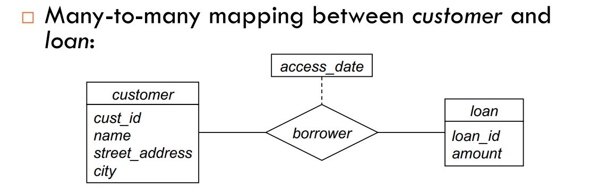
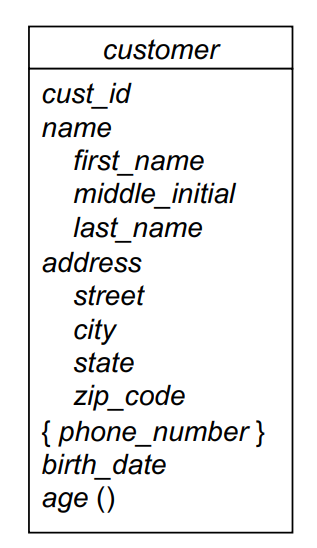

## Database Design

- Database schema (physical/logical/view)
- Programs that access and update data
- Security constraints for data access

### General Approach

- Collect requirements [Data, Operations, UML]
- Design conceptual schema [ER] _high-level no physical and logical_
- Functional requirements specification [SQL] _add, delete, update, query_
- Implementation Phases [SQL] _physical and logical_
- Finally: any necessary physical design [SQL] _indexing, partitioning, etc._

### Importance of Design Phase

- Not all changes have the same impact!
- Physical-level changes have the least impact
- Logical-level changes are typically much bigger
- _NOTE:_ Very important to spend time up front designing the
  database schema

### Design Decisions

- Redundant information wastes space
- Ideally: each fact appears in exactly one place
- Schema must be able to fully represent all details and
  relationships required by the application
- Performance and Scalability considerations

### The Entity-Relationship Model

- Allows for specification of complex schemas in
  graphical form
- Entity: a real-world object distinguishable from other
  objects
- Entity Set: a collection of similar entities
- Relationship: an association among several entities
- Relationship Set: a collection of similar relationships
- Degree of a Relationship: number of participating entities [unary, binary, ternary, etc]
- Cardinality Ratio: number of entities that can participate in a relationship [1:1, 1:N, M:N, etc]

### Entity-Relationship Diagrams

- Diagramming a Relationship-Set

  

- Attribute Structure: simple vs composite, single-valued vs multi-valued, base/source vs derived

  

- Representing Constraints: Can always leave out constraints at implementation time

### Links

- [Optimizing Queries with EXPLAIN](https://dev.mysql.com/doc/refman/8.0/en/using-explain.html)
