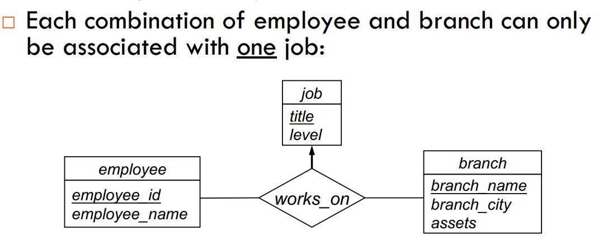
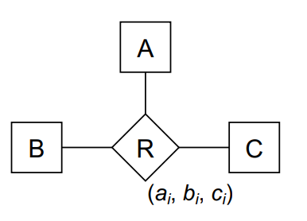
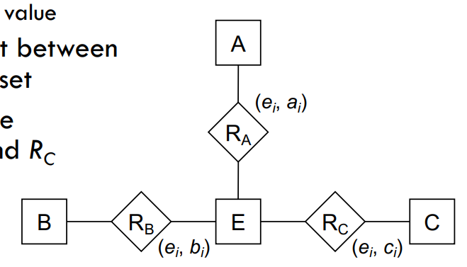
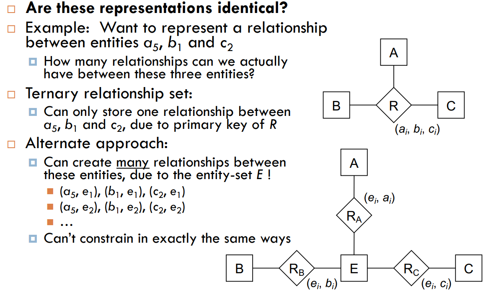
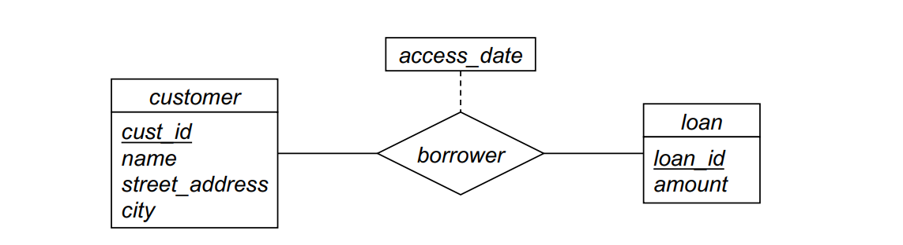
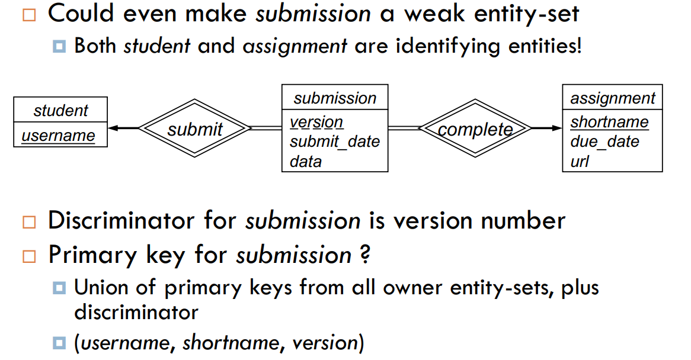

## ENTITY-RELATIONSHIP MODEL III

### N-ary Relationships

- Specify relationships of degree > 2 in E-R model.
- Can specify some mapping cardinalities on relationships with degree > 2
- 
- For degree > 2 relationships, could replace with binary relationships.

- **Binary vs. N-ary Relationships**
  _Binary Relationships:_ are less constrained than n-ary relationships. For example, a binary relationship can be represented as an n-ary relationship with n = 2. However, a binary relationship cannot be represented as an n-ary relationship with n > 2.

  1. Binary vs. N-ary Relationships (1)

    

  2. Binary vs. N-ary Relationships (2)

    

- Are these relationships equivalent?

  

### E-R Model and Real Databases

**Entity-Sets**

- Biggest difference is E-R composite/multivalued attributes, vs. relational model atomic attributes
- Three components of conversion process:
  1. Specify schema of the relation itself
  2. Specify primary key on the relation
  3. Specify any foreign key references to other relations
- Strong entity-sets require no foreign keys to other things

**Relationship-Sets**

- Relationship-Sets is the union of all participating entity-sets’ primary key attributes + descriptive attributes on R (if any)
- If many-to-many mapping: create a new relation with the primary key attributes of the participating entity-sets as foreign keys
- If one-to-many mapping: add the primary key of the “one” side as a foreign key to the “many” side
- If one-to-one mapping: add the primary key of either side as a foreign key to the other side
- Relationship-Set Foreign Keys: Relation schema notation doesn’t provide mechanism for indicating foreign key constraints _Making notes on your relational model schema is a very good idea_
- Relation schema for borrower:
  
  - Primary key of customer is cust_id
  - Primary key of loan is loan_id
  - Descriptive attribute access_date
  - borrower mapping cardinality is many-to-many
  - Result: borrower(cust_id, loan_id, access_date)

**Weak Entity-Sets**

- Depend on at least one strong entity-set
- The identifying entity-set, or owner entity-set
- Relationship between the two is called the identifying relationship
- Weak entity-sets have a discriminator, which is a descriptive attribute that distinguishes between entities in the weak entity-set that have the same partial key

**Composite Attributes:** Composite attributes are represented as separate attributes in the relation schema

**Multivalued Attributes:** Multivalued attributes are represented as a separate relation with a foreign key to the relation schema of the strong entity-set
