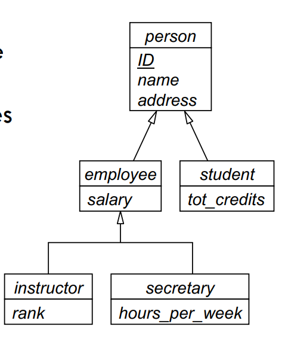
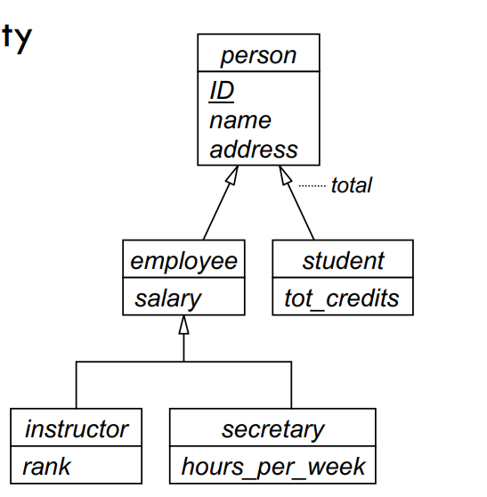
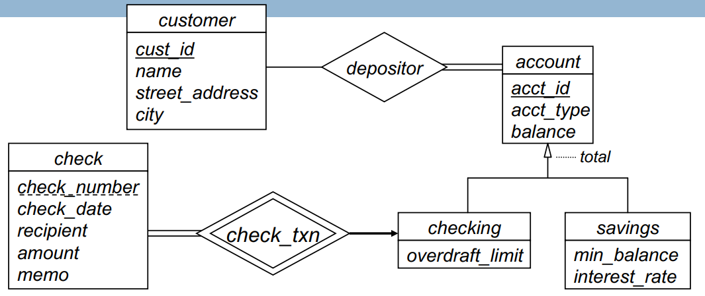
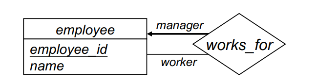
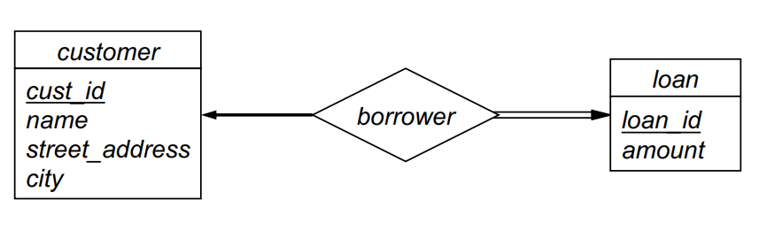

## Advanced ER Features

- **Specialization, Generalization and Aggregation** are extensions to the basic ER model, which allow modeling of more complex database applications
- **Specialization**: Top-down design process; process of defining a set of subclasses of an entity type
- **Generalization**: Bottom-up design process; process of defining a higher-level entity type that encompasses two or more lower-level entity types
- **Aggregation**: A form of association that specifies a whole-part relationship between two entities (not discussed in this course)

### Specialization (inheritance)

- _Attributes_ of higher-level entity type are _inherited_ by lower-level entity sets
- _Relationship_ sets of higher-level entity type are inherited by lower-level entity sets
  - A lower-level entity can participate as an _independent entity_ in a relationship set
- Entity-sets inherit from one superclass (hierarchy)
- Entity-sets can inherit multiple superclasses (lattice)

### Specialization Constraints

- **Disjointness constraint**: Specifies that the subclasses of the specialization must be disjoint
  1. **Disjoint**: Subclasses of the specialization must be disjoint
  2. **Overlapping**: Subclasses of the specialization may overlap



- Disjoint constraint: An employee can be an instructor or a secretary, but not both.
- Overlapping constraint: A person can be an employee of the university and a student.

---

- **Completeness constraint**: Specifies whether each entity in the superclass must belong to at least one subclass in the specialization
  1. **Total**: Every entity in the superclass must be a member of some subclass in the specialization
  2. **Partial**: An entity in the superclass may not belong to any subclass in the specialization



- Total constraint: Every person must be an employee, a student, or both.
- Partial constraint: Not every employee is an instructor or a secretary.

---

- **Membership constraints**: specify which lower-level entity-sets each entity is a member of

  - e.g. which accounts are checking or savings accounts

- _Condition-defined_ membership in a lower-level entity-set is determined by the satisfaction of a condition
  - e.g. account could have an account_type attribute set to “c” for checking, or “s” for savings



- Would also create relationship-sets against various entity-sets in hierarchy
  - associate customer with account
  - associate check weak entity-set with checking

---

### Mapping to Relational Model

- Three options for mapping specialization or generalization hierarchies to relations

  1. **Class per subclass**: Create a relation for each subclass of the specialization (_Recommended_)
  2. **Single relation**: Combine all subclasses into a single relation
  3. **Class per level**: Create a relation for each _level_ of the specialization hierarchy

- **Class per subclass**: Create a relation for each subclass of the specialization

  - Include all attributes of the superclass
  - Include attributes of the subclass
  - Include the _primary key_ of the superclass as a _foreign key_ in the relation for each subclass

- Alternative mapping has serious drawbacks (_2 and 3_)
  - **Single relation**: Combine all subclasses into a single relation
    - Many null values
    - Poor data independence
  - **Class per level**: Create a relation for each _level_ of the specialization hierarchy
    - Redundant information
    - Poor data independence

### Schema Combination

- mane-to-one relationship between weak entity-set and strong entity-set doesn’t need represented separately
  

```sql
employee(employee_id, name, manager_id)
```

- (A very common schema combination)
- Need to store null for employees with no manager

---

- One-to-one relationship between weak entity-set and identifying entity-set can be represented by merging the two entity-sets
  

```sql
customer(cust_id, name, street_address, city)
loan(loan_id, cust_id, amount)
```

- Benefits of schema combination:

  - Reduces the number of foreign key constraints
    - constraint enforcement overhead
    - extra join operations in queries
  - Reduces storage requirements

- Drawbacks of schema combination:
  - May result in null values
  - Makes it harder to change mapping cardinality constraints in the future
