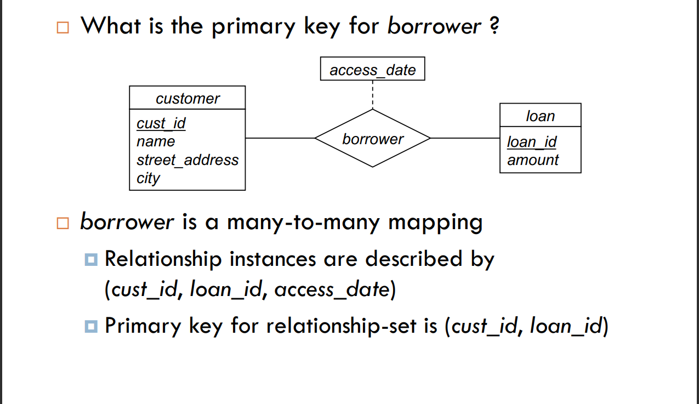
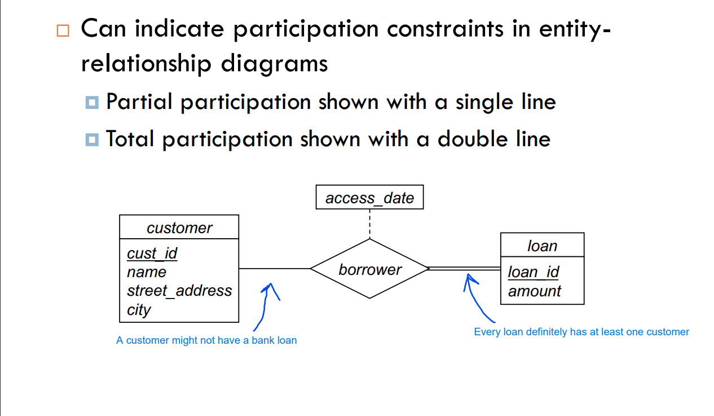
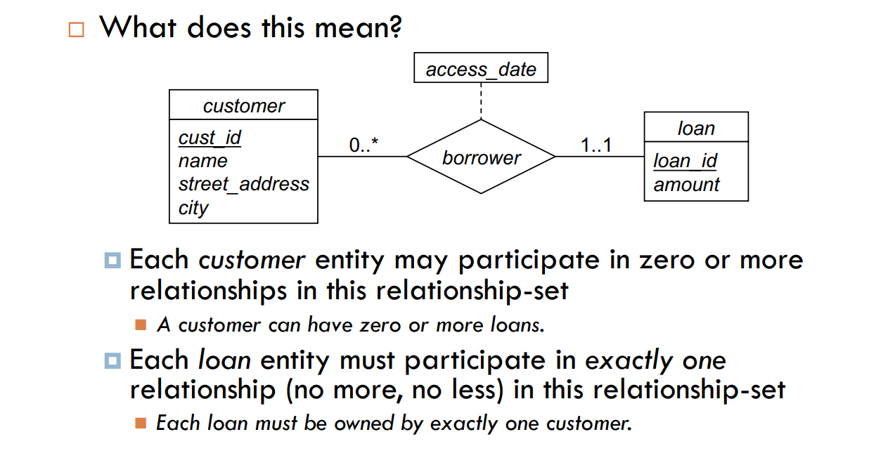
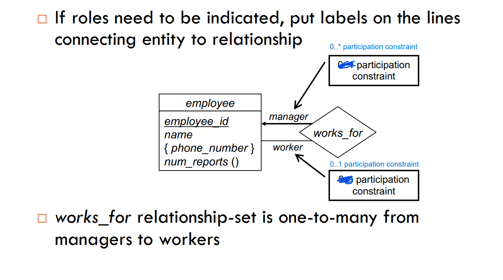
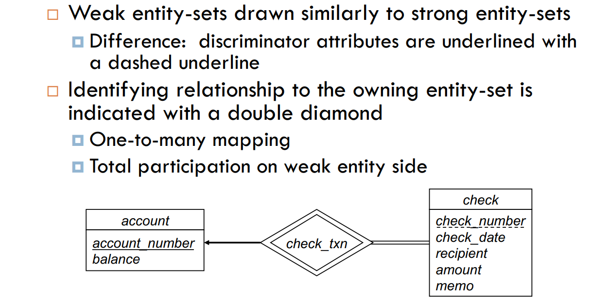
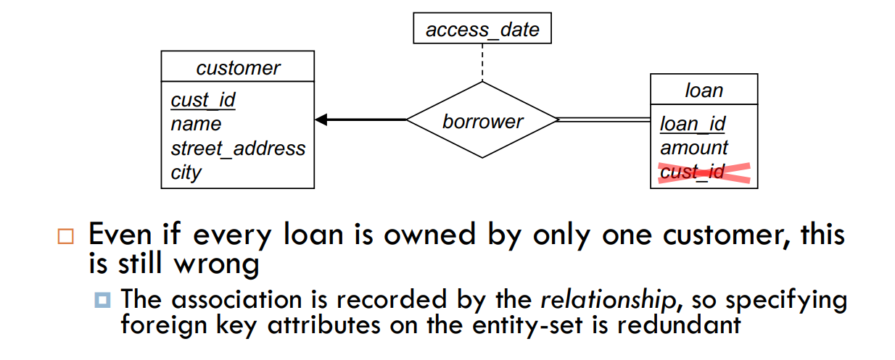
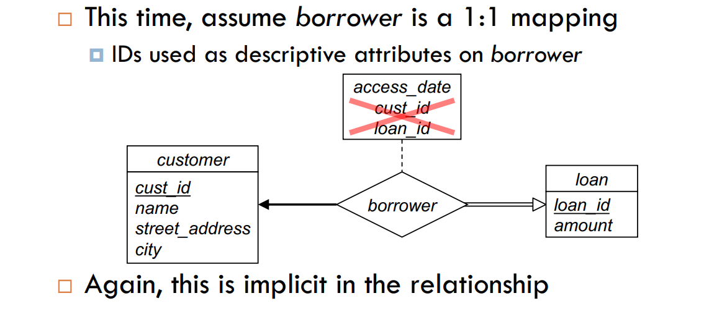

## Entity-Relationship Model II

### 1. Entity-Set Keys

- **Superkey:** a set of one or more attributes that, taken collectively, allows us to identify uniquely an entity in the entity set
- **Candidate Key:** a minimal superkey
- **Primary Key:** a candidate key chosen by the database designer to uniquely identify the entity set

### 2. Relationship-Set Primary Keys

- Relationship-Set Primary Key: a set of attributes whose values uniquely identify each relationship in the relationship set.
- One-to-One Relationship: either side can be the primary key.
- One-to-Many Relationship: the primary key of the "one" side becomes a foreign key in the "many" side.
- Many-to-Many Relationship: the primary key of the "many" side becomes a foreign key in the "many" side.

### 3. Participation Constraints

- **Total Participation:** every entity in the entity set participates in at least one relationship in the relationship set.
- **Partial Participation:** some entities may not participate in any relationship in the relationship set.

Numerical Constraint Example

- **Diagraming Roles:** use a directed line to indicate the role of an entity in a relationship set.

Many workers to one manager example (_rare use case_):

### 4. Weak Entity Sets

- **Weak Entity Set:** an entity set that does not have a primary key.
- **Identifying Relationship:** the relationship between a weak entity set and its owner entity set.
- Every weak entity must be related to an owner entity via an identifying relationship set.
- Every weak entity set must have a total participation constraint (one-to-many) with respect to the identifying relationship (_cascade-delete_).
- The _discriminator_ (partial key) of a weak entity set is underlined with a dashed line.

Diagramming Weak Entity-Sets

### 5. Common Design Pitfalls

- **Entity-Set vs. Relationship-Set:** a relationship set is not an entity set.

- Don’t include entity-set primary key attributes on
  other entity-sets!
  

- Don’t include primary key attributes as descriptive
  attributes on relationship-set, either!
  
